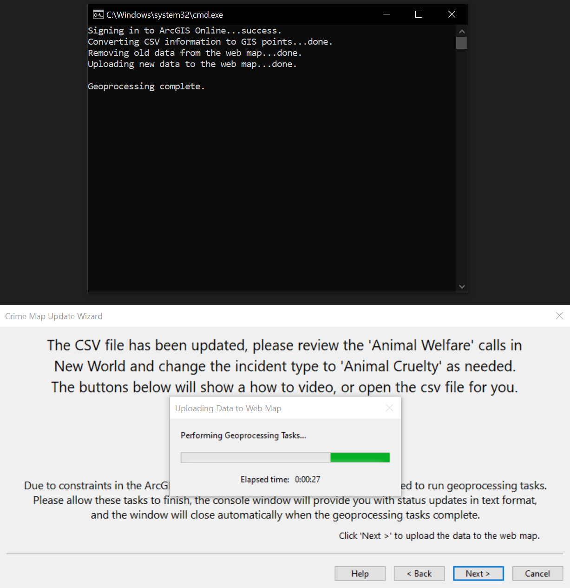

# Crime-Map-Wizard
This tool was written to help the volunteers at the Kalispell Police Department update the Kalispell Crime Heatmap quickly and easily, no more copy/pasting in Excel, and no need to open ArcGIS Pro.

Crime Map Wizard is a newer version of the Crime Map Update Assistant that provides a graphical wizard with the previous three geoprocessing scripts improved and condensed into a single script.  The user interface is written in C++ using wxWidgets, and the geoprocessing script is written in Python using the ArcGIS ArcPy module.

## Image Gallery

|Step One|Step Two|
|:-:|:-:|
|  |  |
|Step Three|Success|
|  |  |

## Dependencies

### OpenXLSX

&nbsp;&nbsp;&nbsp;&nbsp;*OpenXLSX is a C++ library for reading, writing, creating, and modifying Microsoft Excel® files, with the .xlsx format.*
* [OpenXLSX GitHub Repository](https://github.com/troldal/OpenXLSX)

### wxWidgets

&nbsp;&nbsp;&nbsp;&nbsp;*wxWidgets is a C++ library that lets developers create applications for Windows, macOS, Linux and other platforms with a single code base.*
  * [wxWidgets.org](https://wiki.wxwidgets.org/Install)
    
### Python
&nbsp;&nbsp;&nbsp;&nbsp;*Python is a high-level, general-purpose programming language.*
  * [Python.org](https://www.python.org/)
    
### ArcPy Python Module
&nbsp;&nbsp;&nbsp;&nbsp;*ArcPy is a Python site package that provides a useful and productive way to perform geographic data analysis, data conversion, data management, and map automation with Python.*
  * [ArcPy Python Reference](https://pro.arcgis.com/en/pro-app/latest/arcpy/)
